# 테라폼으로 eks 프로비저닝하기

## 1. 준비

### 1.1. 배스천 생성
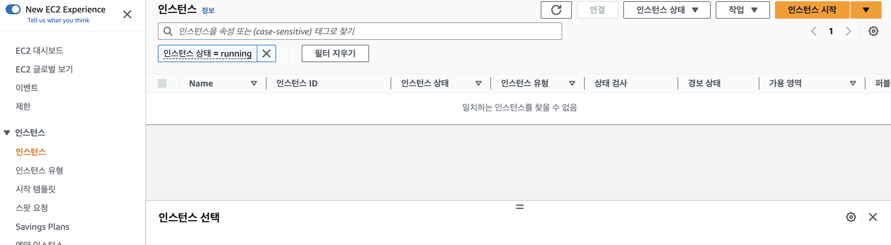

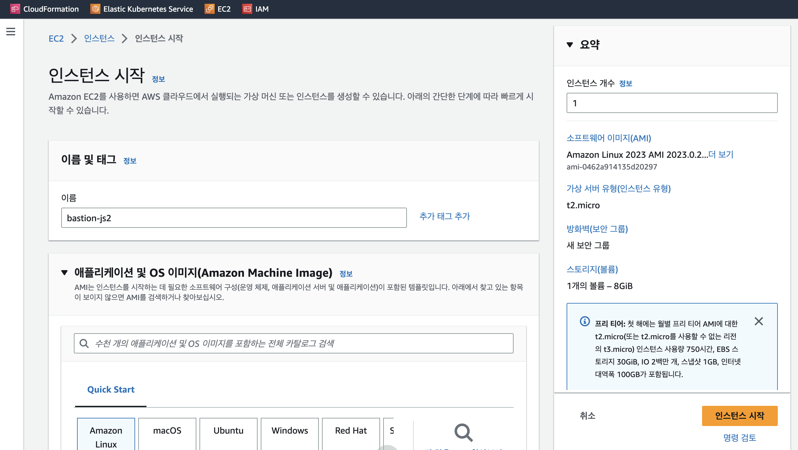

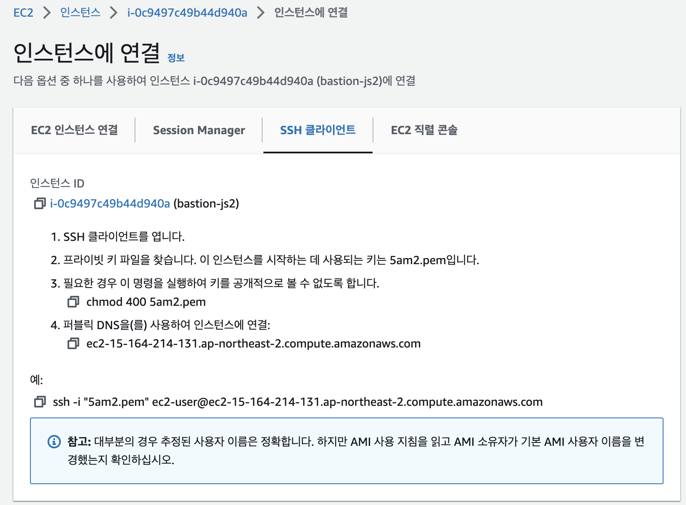

```sh
$ workspace % ll
\total 8
drwxr-xr-x   4 human.m2  staff   128  6 24 23:20 .
drwxr-x---+ 24 human.m2  staff   768  6 24 23:19 ..
-rw-r--r--@  1 human.m2  staff  1678  6 24 23:18 5am2.pem
drwxr-xr-x   8 human.m2  staff   256  6 24 23:18 mentor
$ workspace % chmod 400 5am2.pem 

$ workspace % ssh -i "5am2.pem" ec2-user@ec2-15-164-214-131.ap-northeast-2.compute.amazonaws.com
The authenticity of host 'ec2-15-164-214-131.ap-northeast-2.compute.amazonaws.com (15.164.214.131)' can't be established.
ED25519 key fingerprint is SHA256:HAnqFvKosoNxE1vJyZ/uk1CZV/JKqYOxje2p4ns0y+k.
This key is not known by any other names
Are you sure you want to continue connecting (yes/no/[fingerprint])? yes
Warning: Permanently added 'ec2-15-164-214-131.ap-northeast-2.compute.amazonaws.com' (ED25519) to the list of known hosts.
   ,     #_
   ~\_  ####_        Amazon Linux 2023
  ~~  \_#####\
  ~~     \###|
  ~~       \#/ ___   https://aws.amazon.com/linux/amazon-linux-2023
   ~~       V~' '->
    ~~~         /
      ~~._.   _/
         _/ _/
       _/m/'


[ec2-user@ip-172-31-30-226 ~]$ sudo -i
```

### 1.2. AWS 구성정보 입력

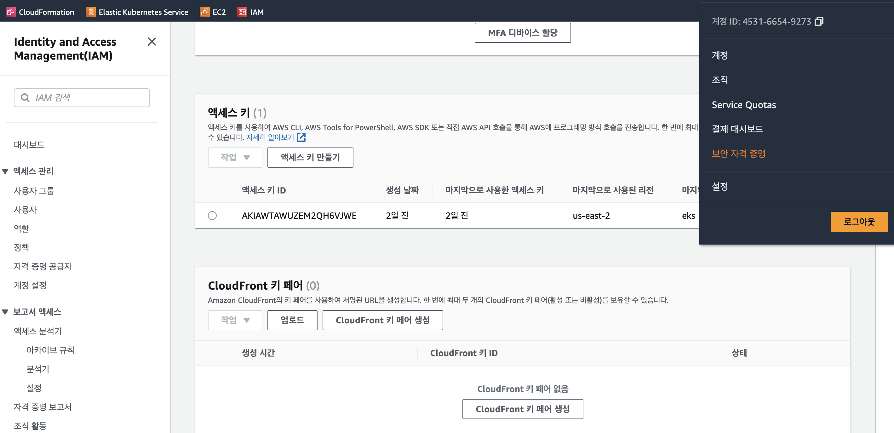

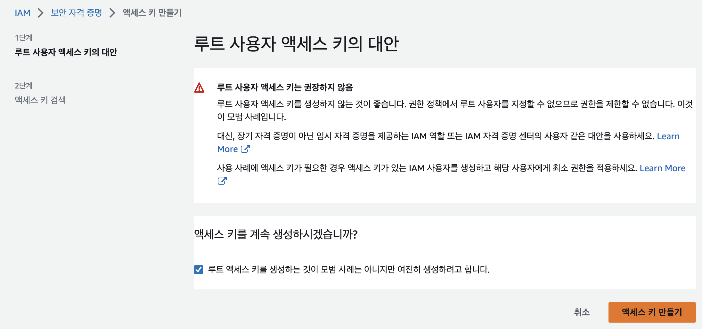

```sh
[ec2-user@ip-172-31-30-226 learn-terraform-provision-eks-cluster]$ aws configure
AWS Access Key ID [None]: AKIAWTA
AWS Secret Access Key [None]: kT6Xy
Default region name [ap-northeast-2]: ap-northeast-2
Default output format [None]:
```

### 1.3. 테라폼 설치

https://developer.hashicorp.com/terraform/tutorials/aws-get-started/install-cli

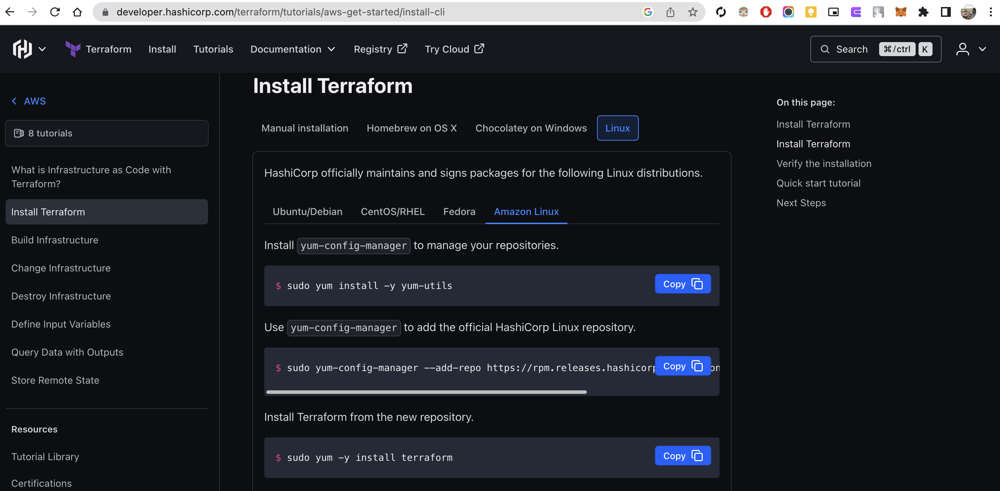

```sh
$ yum install -y yum-utils
$ yum-config-manager --add-repo https://rpm.releases.hashicorp.com/AmazonLinux/hashicorp.repo
$ yum -y install terraform
```

## 2. EKS 구성

https://developer.hashicorp.com/terraform/tutorials/kubernetes/eks

### 2.1. TF 파일 다운로드 및 수정

다운로드
`git clone https://github.com/hashicorp/learn-terraform-provision-eks-cluster`

main.tf 내 CSI 생성 구문 주석 처리
- 동적 PV 할당을 위하여, AWS CSI 매니지드 서비스를 사용하는 방법도 있으나
- nfs-subdir-external-provisioner 오픈소스를 활용해보기 위하여 일단 주석 처리 한다.

```
/*
data "aws_iam_policy" "ebs_csi_policy" {
  arn = "arn:aws:iam::aws:policy/service-role/AmazonEBSCSIDriverPolicy"
}

module "irsa-ebs-csi" {
  source  = "terraform-aws-modules/iam/aws//modules/iam-assumable-role-with-oidc"
  version = "4.7.0"

  create_role                   = true
  role_name                     = "AmazonEKSTFEBSCSIRole-${module.eks.cluster_name}"
  provider_url                  = module.eks.oidc_provider
  role_policy_arns              = [data.aws_iam_policy.ebs_csi_policy.arn]
  oidc_fully_qualified_subjects = ["system:serviceaccount:kube-system:ebs-csi-controller-sa"]
}

resource "aws_eks_addon" "ebs-csi" {
  cluster_name             = module.eks.cluster_name
  addon_name               = "aws-ebs-csi-driver"
  addon_version            = "v1.5.2-eksbuild.1"
  service_account_role_arn = module.irsa-ebs-csi.iam_role_arn
  tags = {
    "eks_addon" = "ebs-csi"
    "terraform" = "true"
  }
}
*/
```


variables.tf
- 사용할 리전으로 정보 수정 
```
$ cat variables.tf
# Copyright (c) HashiCorp, Inc.
# SPDX-License-Identifier: MPL-2.0

variable "region" {
  description = "AWS region"
  type        = string
  default     = "ap-northeast-2"
}
```

### 2.2. terraform apply

```sh
[ec2-user@ip-172-31-30-226 learn-terraform-provision-eks-cluster]$ terraform apply
...
module.eks.module.eks_managed_node_group["one"].aws_eks_node_group.this[0]: Creation complete after 2m0s [id=education-eks-Z2pyYxDq:node-group-1-20230625000907261200000015]
module.eks.module.eks_managed_node_group["two"].aws_eks_node_group.this[0]: Still creating... [2m0s elapsed]
module.eks.module.eks_managed_node_group["two"].aws_eks_node_group.this[0]: Creation complete after 2m10s [id=education-eks-Z2pyYxDq:node-group-2-20230625000907265600000017]

Apply complete! Resources: 55 added, 0 changed, 0 destroyed.

Outputs:

cluster_endpoint = "https://F3A2A84F546C11B0B00A8310736BA61D.gr7.ap-northeast-2.eks.amazonaws.com"
cluster_name = "education-eks-Z2pyYxDq"
cluster_security_group_id = "sg-0f4c5dfda4430561c"
region = "ap-northeast-2"
```

EKS 정보 확인
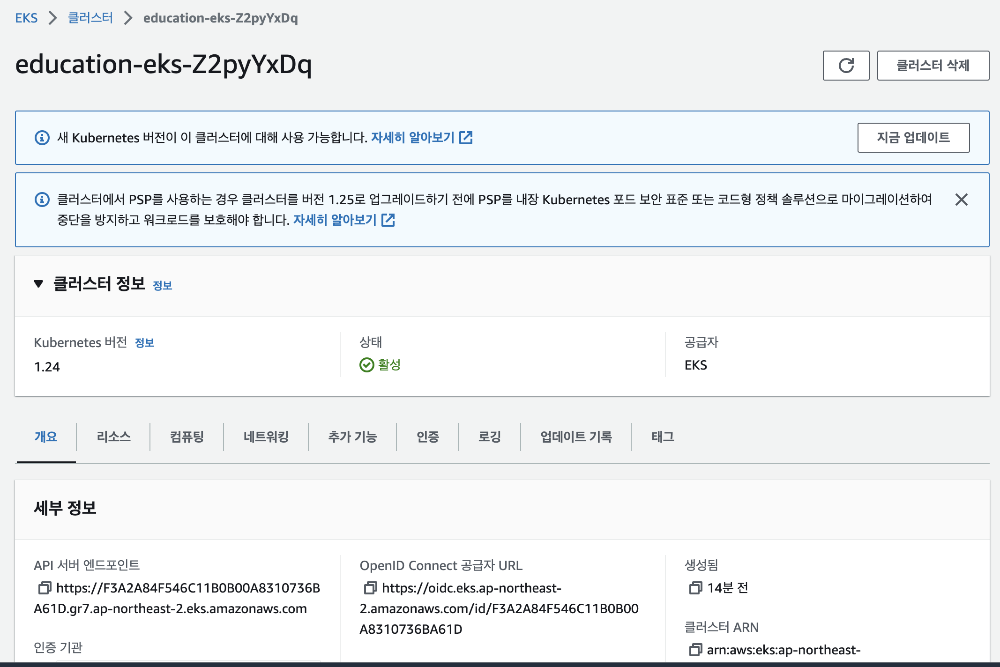

kubeconfig 다운로드
```sh
$ aws eks --region $(terraform output -raw region) update-kubeconfig \
    --name $(terraform output -raw cluster_name)
Added new context arn:aws:eks:ap-northeast-2:453166549273:cluster/education-eks-Z2pyYxDq to /home/ec2-user/.kube/config
```

kubectl 다운로드 : https://kubernetes.io/docs/tasks/tools/install-kubectl-linux/
```sh
[ec2-user@ip-172-31-30-226 learn-terraform-provision-eks-cluster]$ curl -LO "https://dl.k8s.io/release/$(curl -L -s https://dl.k8s.io/release/stable.txt)/bin/linux/amd64/kubectl"
  % Total    % Received % Xferd  Average Speed   Time    Time     Time  Current
                                 Dload  Upload   Total   Spent    Left  Speed
100   138  100   138    0     0    670      0 --:--:-- --:--:-- --:--:--   673
100 46.9M  100 46.9M    0     0  20.4M      0  0:00:02  0:00:02 --:--:-- 30.0M
[ec2-user@ip-172-31-30-226 learn-terraform-provision-eks-cluster]$ chmod +x kubectl
[ec2-user@ip-172-31-30-226 learn-terraform-provision-eks-cluster]$ sudo mv kubectl /usr/bin
```

### 2.3. 클러스터 동작 확인 (smoke test)

클러스터 정보 확인
```sh
[ec2-user@ip-172-31-30-226 learn-terraform-provision-eks-cluster]$ kubectl cluster-info
Kubernetes control plane is running at https://F3A2A84F546C11B0B00A8310736BA61D.gr7.ap-northeast-2.eks.amazonaws.com
CoreDNS is running at https://F3A2A84F546C11B0B00A8310736BA61D.gr7.ap-northeast-2.eks.amazonaws.com/api/v1/namespaces/kube-system/services/kube-dns:dns/proxy

To further debug and diagnose cluster problems, use 'kubectl cluster-info dump'.

[ec2-user@ip-172-31-30-226 learn-terraform-provision-eks-cluster]$ kubectl get no
NAME                                            STATUS   ROLES    AGE   VERSION
ip-10-0-1-159.ap-northeast-2.compute.internal   Ready    <none>   11m   v1.24.13-eks-0a21954
ip-10-0-1-8.ap-northeast-2.compute.internal     Ready    <none>   11m   v1.24.13-eks-0a21954
ip-10-0-3-35.ap-northeast-2.compute.internal    Ready    <none>   11m   v1.24.13-eks-0a21954
```

애플리케이션 배포 테스트
```yaml
apiVersion: apps/v1 # for versions before 1.9.0 use apps/v1beta2
kind: Deployment
metadata:
  name: nginx
spec:
  selector:
    matchLabels:
      app: nginx
  replicas: 3
  template:
    metadata:
      labels:
        app: nginx
    spec:
      containers:
      - name: nginx
        image: nginx
        ports:
        - containerPort: 80
---
apiVersion: v1
kind: Service
metadata:
  name: nginx
  namespace: default
  labels:
    app: nginx
spec:
  ports:
  - name: http
    port: 80
    protocol: TCP
    targetPort: 80
  selector:
    app: nginx
```

## 3. Dynamic PV 환경 구성

동적으로 PV 구성하는 방법
- [오픈소스 프로비저너](https://github.com/kubernetes-sigs/nfs-subdir-external-provisioner
) 사용 (nfs 환경 필요)
- CSI 환경 사용

### 3.1. 오픈소스 프로비저너

본 구성에서는 오픈소스 프로비저너 사용 방법을 먼저 진행해보고, 이후에는 AWS CSI 환경을 사용한다.

AWS EFS 생성 (nfs 상품)
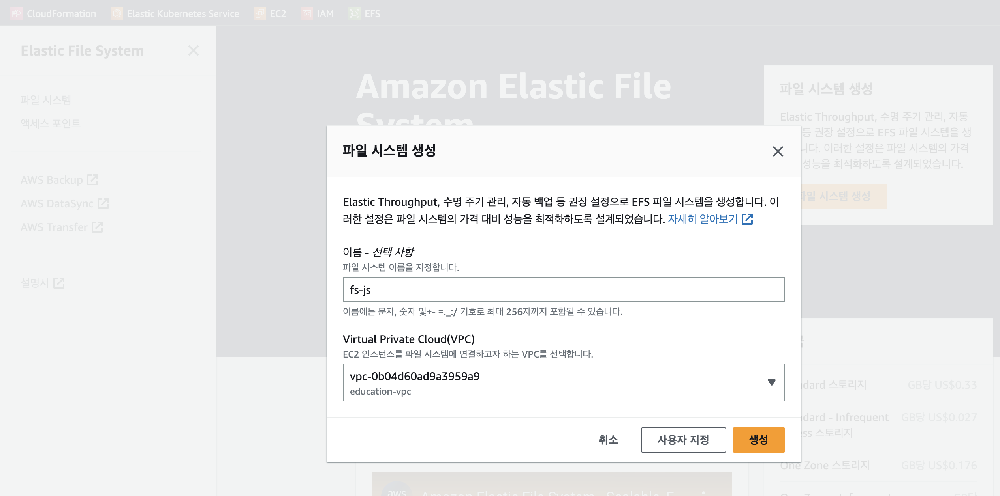
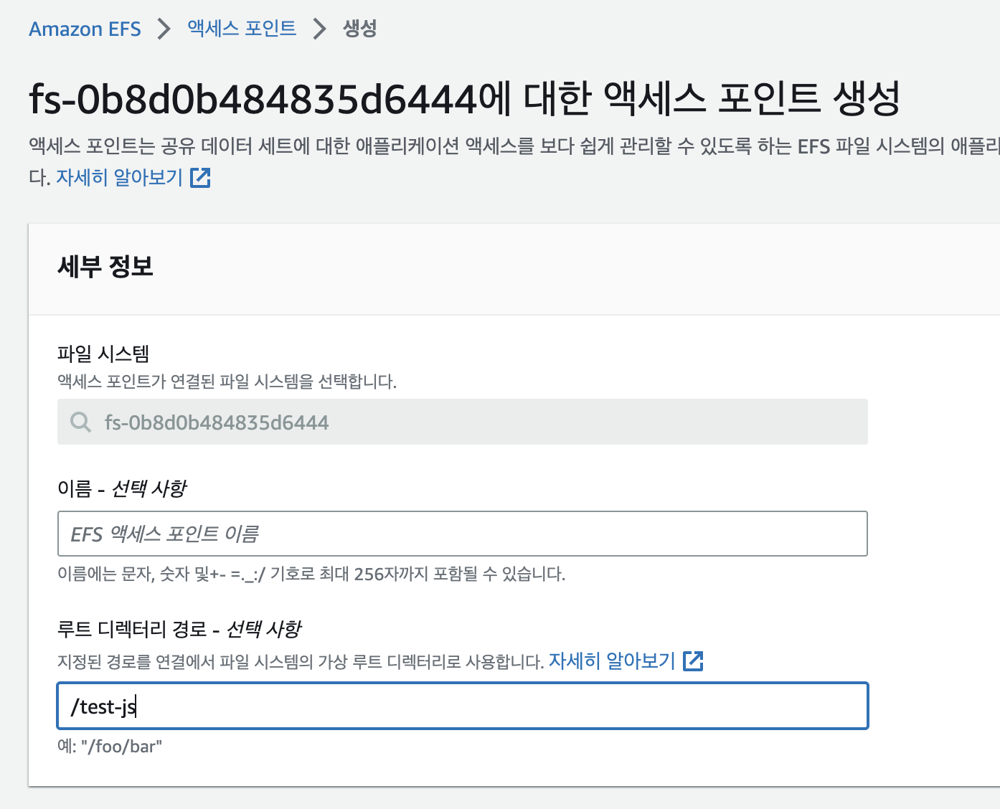

EFS security group inbound 설정 추가 필요
- 편의상 all open (보안 취약)


```sh
$ helm repo add nfs-subdir-external-provisioner https://kubernetes-sigs.github.io/nfs-subdir-external-provisioner/
$ helm install nfs-subdir-external-provisioner nfs-subdir-external-provisioner/nfs-subdir-external-provisioner \
    --namespace kube-system \
    --set nfs.server=fs-0xxxxxx.efs.ap-northeast-2.amazonaws.com \
    --set nfs.path=/test-js

$ k get po -n kube-system
NAME                                              READY   STATUS    RESTARTS   AGE
aws-node-pqzwc                                    1/1     Running   0          101m
aws-node-r5gsx                                    1/1     Running   0          101m
aws-node-tkd5f                                    1/1     Running   0          101m
coredns-dc4979556-bfbgs                           1/1     Running   0          105m
coredns-dc4979556-fhjkn                           1/1     Running   0          105m
kube-proxy-4fjcw                                  1/1     Running   0          101m
kube-proxy-p2qs4                                  1/1     Running   0          101m
kube-proxy-xw7tw                                  1/1     Running   0          101m
nfs-subdir-external-provisioner-9b9dc6f7b-6k2tp   1/1     Running   0          5s

$ k get storageclass
NAME            PROVISIONER                                     RECLAIMPOLICY   VOLUMEBINDINGMODE      ALLOWVOLUMEEXPANSION   AGE
nfs-client      cluster.local/nfs-subdir-external-provisioner   Delete          Immediate              true                   25s
```

애플리케이션 테스트

```yaml
apiVersion: apps/v1
kind: Deployment
metadata:
  name: nginx
spec:
  selector:
    matchLabels:
      app: nginx
  replicas: 3
  template:
    metadata:
      labels:
        app: nginx
    spec:
      containers:
      - name: nginx
        image: nginx
        ports:
        - containerPort: 80
        volumeMounts:
        - mountPath: "/usr/share/nginx/html/temp"
          name: mypd
      volumes:
      - name: mypd
        persistentVolumeClaim:
          claimName: myclaim
---
apiVersion: v1
kind: Service
metadata:
  name: nginx
  namespace: default
  labels:
    app: nginx
spec:
  ports:
  - name: http
    port: 80
    protocol: TCP
    targetPort: 80
  selector:
    app: nginx
---
apiVersion: v1
kind: PersistentVolumeClaim
metadata:
  name: myclaim
spec:
  storageClassName: nfs-client
  accessModes:
    - ReadWriteOnce
  resources:
    requests:
      storage: 1Gi
```

### 3.2. CSI

CSI 제공되는 환경에서는 CSI를 쓰는것이 더 편하다.
2.1 의 CSI 주석처리 해제하고 사용

## 4. 자원 비용 줄이기 & Clean up

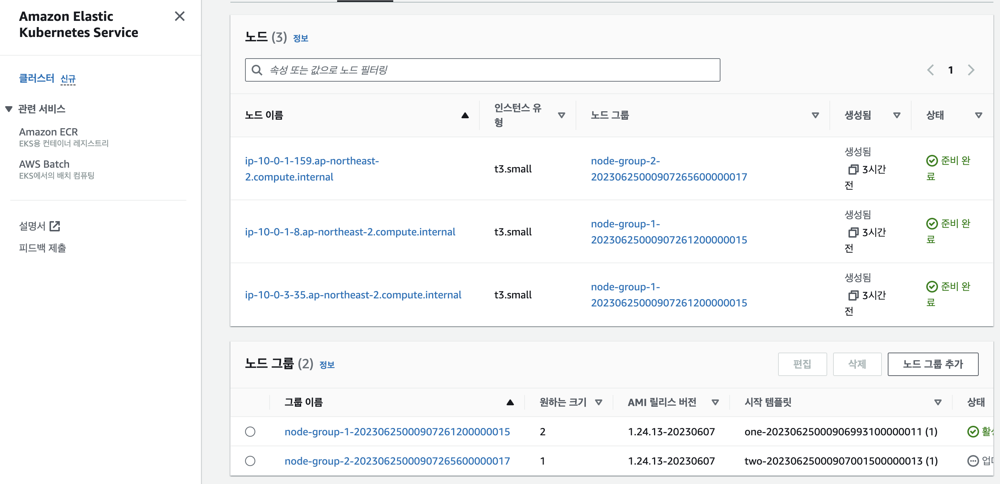

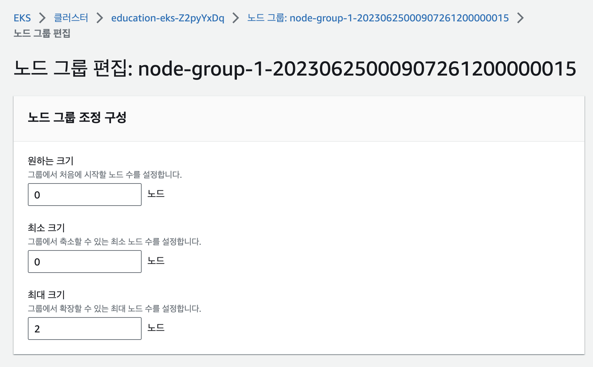

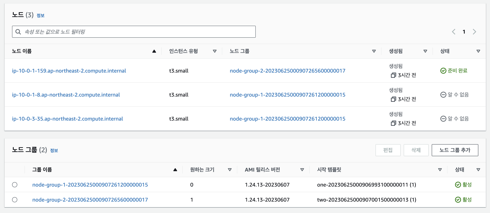

### 4.1. 워커노드 자원 줄이기

사용하지 않을때는, desired_size를 콘솔에서 0 변경
이렇게 하면, VM은 삭제되고, 컨트롤 플레인 비용만 청구됨

> 참고로, tf 파일에서 이하로 정의하는 것은 적용되지 않음
```
  eks_managed_node_groups = {
    one = {
      name = "node-group-1"

      instance_types = ["t3.small"]

      min_size     = 1
      max_size     = 2
      desired_size = 2
    }

    two = {
      name = "node-group-2"

      instance_types = ["t3.small"]

      min_size     = 0
      max_size     = 1
      desired_size = 1
    }
  }
```

### 4.2. Clean up
앞으로 사용하지 않는 자원은 영구적으로 삭제한다.

테라폼으로 생성한 EKS 자원 삭제
```sh
$ terraform destroy
```

EFS 생성한 경우 콘솔에서 EFS 삭제필요

